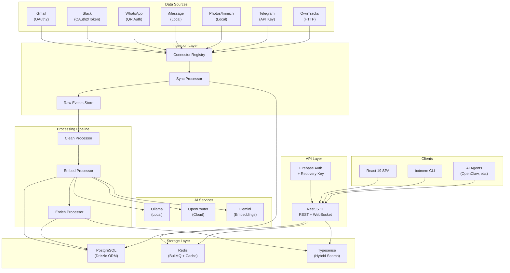
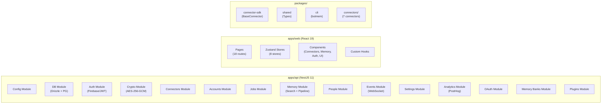
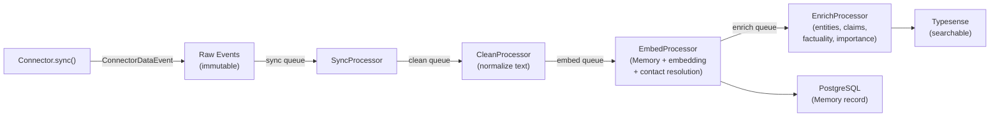
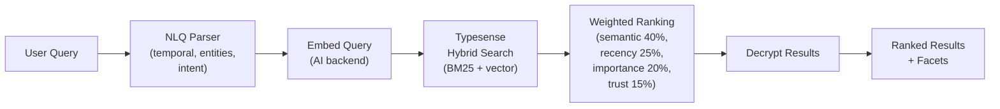
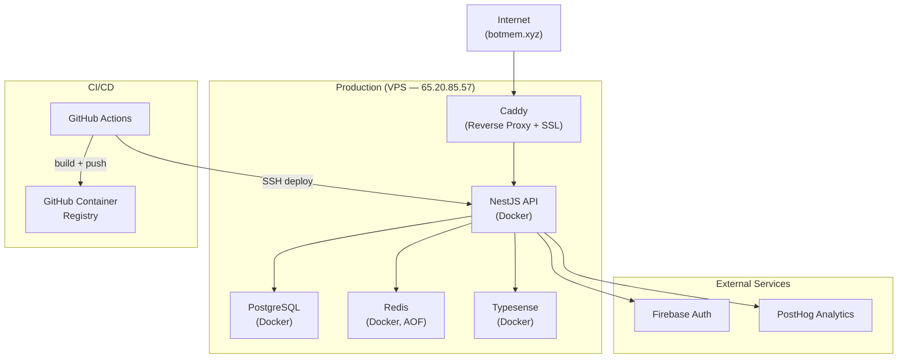

# Botmem — High-Level Design (HLD)

## 1. System Overview

Botmem is a **local-first personal memory RAG system** that ingests events from multiple data sources (emails, messages, photos, locations), normalizes them into a unified memory schema, and provides cross-modal retrieval with weighted ranking.

---

## 2. Architecture Style

| Aspect         | Choice                                 | Rationale                                                               |
| -------------- | -------------------------------------- | ----------------------------------------------------------------------- |
| **Pattern**    | Modular monolith (NestJS modules)      | Single deployable, clear module boundaries, future-ready for extraction |
| **Data flow**  | Event-driven pipeline (BullMQ)         | Decoupled stages, retry semantics, backpressure handling                |
| **Search**     | Hybrid RAG (BM25 + vector)             | Best-of-both-worlds: keyword precision + semantic recall                |
| **Auth**       | Firebase Auth + client-side encryption | Zero-knowledge encryption, portable identity                            |
| **Deployment** | Docker Compose on VPS                  | Self-hosted, privacy-first, single-machine simplicity                   |

---

## 3. Key Design Decisions

### 3.1 Store Everything, Label Confidence

Memories are never deleted. Each carries a factuality label (`FACT`, `UNVERIFIED`, `FICTION`) with confidence scores. The ranking formula weights trust and factuality into results.

### 3.2 Connector-Agnostic Pipeline

All connectors emit `ConnectorDataEvent` objects. The pipeline doesn't know or care about the source — it normalizes everything into the same `Memory` schema.

### 3.3 Per-User Encryption (Recovery Key)

- User gets a 32-byte random recovery key at signup (shown once)
- All PII data encrypted with AES-256-GCM using a key derived from recovery key
- Server never stores the plaintext key — only SHA-256 hash for verification
- Key cached in memory + Redis (30-day TTL) for session performance

### 3.4 Swappable AI Backend

Three AI backends (Ollama, OpenRouter, Gemini) behind a unified interface. Switching is a single env var change. LLM responses cached by SHA-256 hash to avoid redundant API calls.

---

## 4. Component Architecture

---

## 5. Data Flow Overview

### 5.1 Ingestion Pipeline

### 5.2 Query Pipeline

---

## 6. Infrastructure

---

## 7. Security Architecture

| Layer                  | Mechanism                                                     |
| ---------------------- | ------------------------------------------------------------- |
| **Transport**          | TLS via Caddy auto-SSL                                        |
| **Authentication**     | Firebase Auth (email/password) + JWT tokens                   |
| **Authorization**      | Per-user data isolation (account ownership)                   |
| **Encryption at rest** | AES-256-GCM per-user key (recovery key derived)               |
| **Credential storage** | Encrypted auth context in `accounts` + `connectorCredentials` |
| **Secret management**  | `APP_SECRET` env var for server-side encryption               |
| **Network**            | Tailscale VPN for SSH (public SSH disabled)                   |

---

## 8. Non-Functional Requirements

| Requirement        | Target                       | Implementation                                          |
| ------------------ | ---------------------------- | ------------------------------------------------------- |
| **Privacy**        | Zero-knowledge encryption    | Per-user recovery key, server never sees plaintext key  |
| **Scalability**    | Single-user, multi-connector | BullMQ queues with configurable concurrency             |
| **Reliability**    | Job retry with backoff       | 3 attempts, exponential backoff (5s base), 300s lock    |
| **Search quality** | Hybrid RAG                   | BM25 + vector + weighted scoring                        |
| **Extensibility**  | Plugin connectors            | `BaseConnector` SDK, directory-based loading            |
| **Observability**  | Real-time pipeline status    | WebSocket events, PostHog analytics, structured logging |
