# Botmem — Low-Level Design (LLD)

## 1. Database Schema (PostgreSQL + Drizzle ORM)

### 1.1 Entity-Relationship Diagram

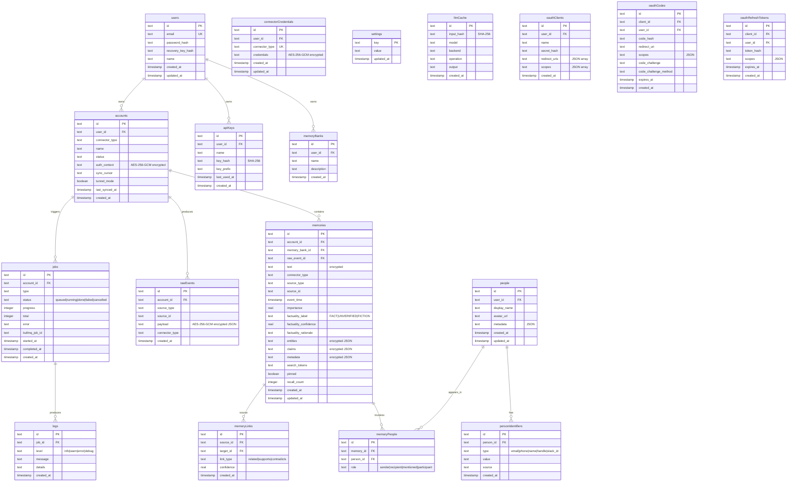

### 1.2 Indexes

| Table | Index | Columns | Purpose |
|-------|-------|---------|---------|
| `memories` | `idx_memories_account_id` | `account_id` | Filter by account |
| `memories` | `idx_memories_event_time` | `event_time` | Temporal queries |
| `memories` | `idx_memories_connector_type` | `connector_type` | Faceted search |
| `rawEvents` | `idx_raw_events_account_source` | `account_id, source_type, source_id` | Dedup check |
| `personIdentifiers` | `idx_person_ident_type_value` | `type, value` | Contact resolution |
| `memoryPeople` | `idx_memory_people_memory` | `memory_id` | Join lookup |
| `memoryPeople` | `idx_memory_people_person` | `person_id` | Contact memory list |
| `accounts` | `idx_accounts_user_id` | `user_id` | User's accounts |

---

## 2. Module Architecture

### 2.1 NestJS Module Dependency Graph

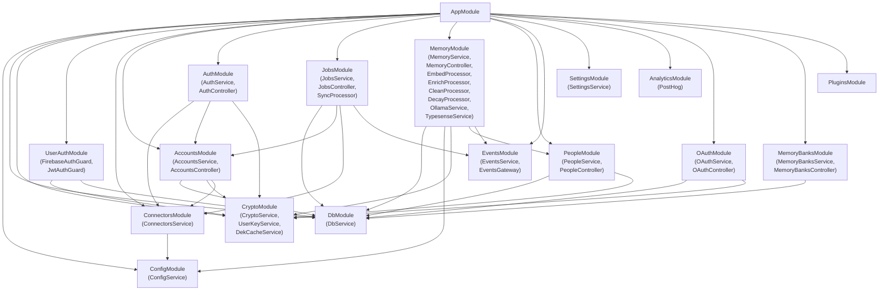

### 2.2 Key Service Classes

#### MemoryService
```
search(query, userId, options) → RankedResult[]
  ├── parseNLQ(query) → temporal filters, entities, intent
  ├── embedQuery(query) → float[]
  ├── resolveUserAccounts(userId) → accountIds[]
  ├── typesenseHybridSearch(text, vector, filters) → raw hits
  ├── applyWeightedRanking(hits) → scored results
  ├── decryptResults(results, userId) → plaintext
  └── buildFacets(hits) → connector/source/factuality/people counts
```

#### CryptoService
```
encrypt(plaintext, key) → { ciphertext, iv, tag }     // AES-256-GCM
decrypt(ciphertext, iv, tag, key) → plaintext
deriveKey(recoveryKey) → Buffer                         // SHA-256
hashRecoveryKey(key) → string                           // SHA-256 hex
```

#### UserKeyService
```
getKey(userId) → Buffer
  ├── checkMemoryCache(userId) → key?
  ├── checkRedisCache(userId) → key? (decrypt w/ APP_SECRET)
  └── throw NeedsRecoveryKeyError
cacheKey(userId, key) → void
  ├── memoryCache.set(userId, key)
  └── redis.set(`dek:${userId}`, encrypt(key, APP_SECRET), 30d)
```

#### ConnectorsService
```
getRegistry() → ConnectorRegistry
  ├── loadBuiltinConnectors()
  └── loadPluginConnectors(PLUGINS_DIR)
getConnector(type) → BaseConnector instance
```

---

## 3. Processing Pipeline — Detailed

### 3.1 Sync Processor

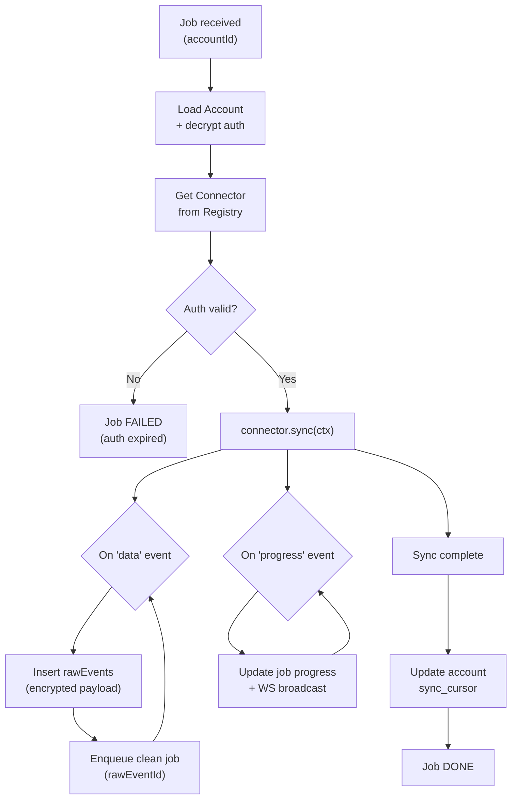

### 3.2 Clean Processor

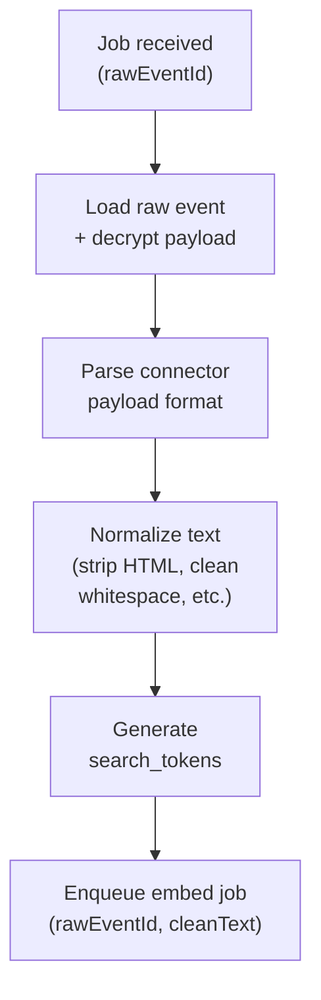

### 3.3 Embed Processor

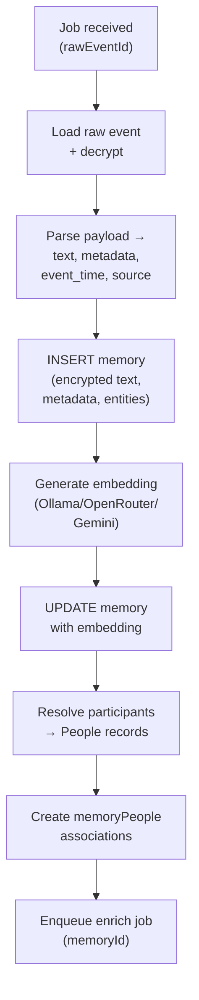

### 3.4 Enrich Processor

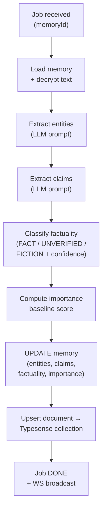

---

## 4. Search System — Detailed

### 4.1 Typesense Collection Schema

```
Collection: memories
├── id (string)
├── text (string, BM25-indexed)
├── connector_type (string, facet)
├── source_type (string, facet)
├── account_id (string, filter)
├── memory_bank_id (string, filter)
├── event_time (int64, sort/filter)
├── factuality_label (string, facet)
├── people (string[], facet, filter)
├── entities_text (string, BM25-indexed)
├── importance (float, sort)
├── pinned (bool, filter)
└── embedding (float[], cosine, num_dim=auto)
```

### 4.2 Search Ranking Formula

```
final_score = 0.40 × semantic
            + 0.25 × recency
            + 0.20 × importance
            + 0.15 × trust

where:
  semantic   = Typesense vector similarity (or hybrid rank_fusion_score)
  recency    = exp(-0.005 × age_in_days)  // search; decay processor uses -0.015
  importance = memory.importance (boosted by recall, pinning, direct mention)
  trust      = connector_base_trust × factuality_confidence
```

### 4.3 NLQ Parser

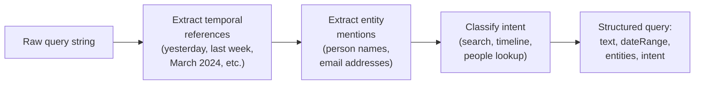

---

## 5. Authentication & Encryption

### 5.1 Recovery Key System

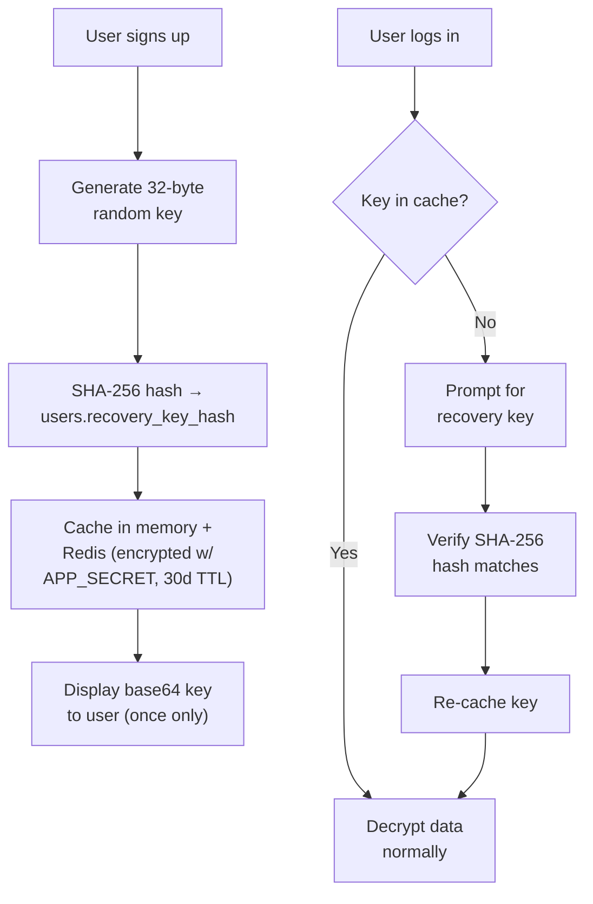

### 5.2 Data Encryption Flow

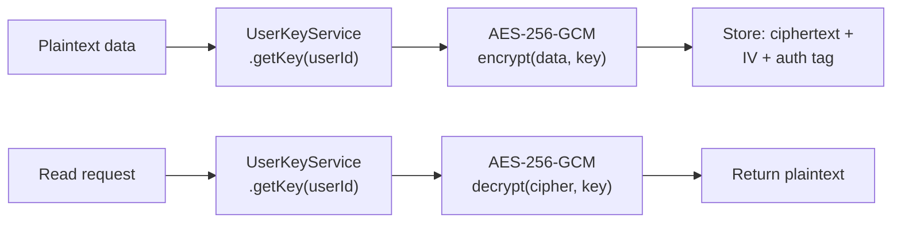

---

## 6. Connector System

### 6.1 Class Hierarchy

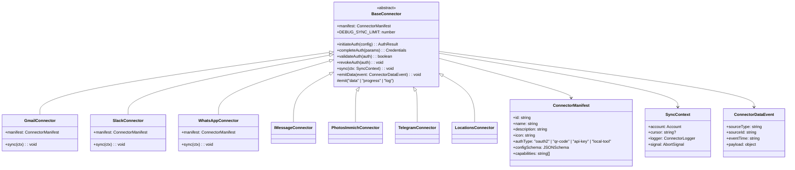

### 6.2 Connector Registry

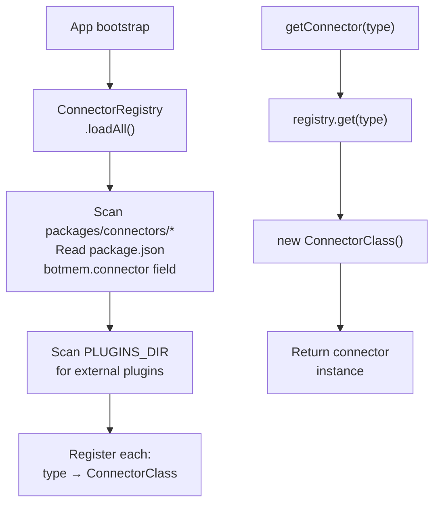

---

## 7. Frontend Architecture

### 7.1 Component Tree

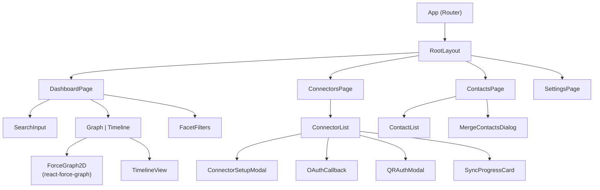

### 7.2 Zustand Store Architecture

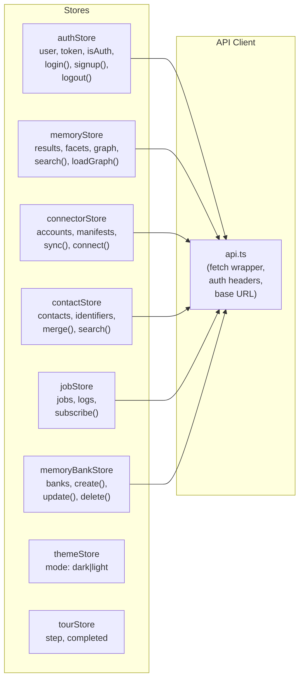

---

## 8. WebSocket Events

### 8.1 Event Flow

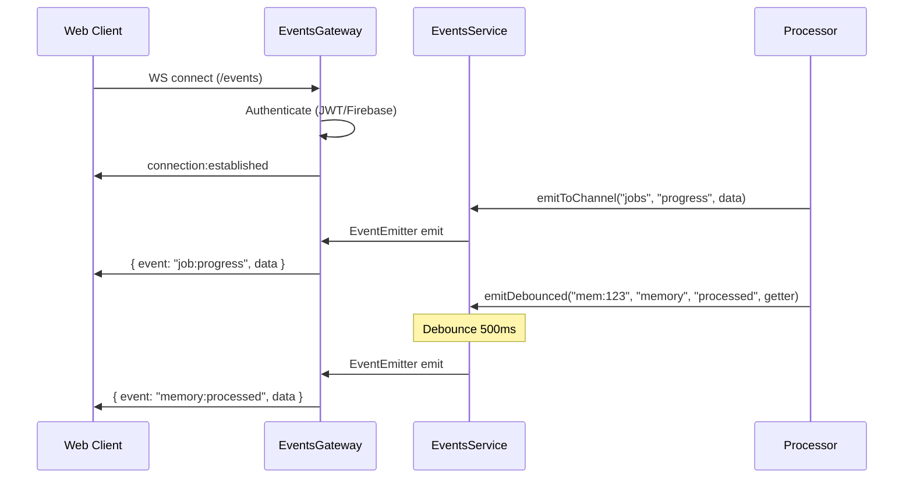

### 8.2 Event Types

| Channel | Event | Payload | Source |
|---------|-------|---------|--------|
| `jobs` | `job:progress` | `{ jobId, progress, total }` | SyncProcessor |
| `jobs` | `job:status` | `{ jobId, status, error? }` | JobsService |
| `memory` | `memory:processed` | `{ memoryId, accountId }` | EmbedProcessor |
| `memory` | `memory:enriched` | `{ memoryId, entities, claims }` | EnrichProcessor |
| `connectors` | `phone-auth:code` | `{ qrCode, accountId }` | WhatsAppConnector |
| `connectors` | `phone-auth:2fa` | `{ accountId }` | WhatsAppConnector |

---

## 9. AI Service Layer

### 9.1 Backend Abstraction

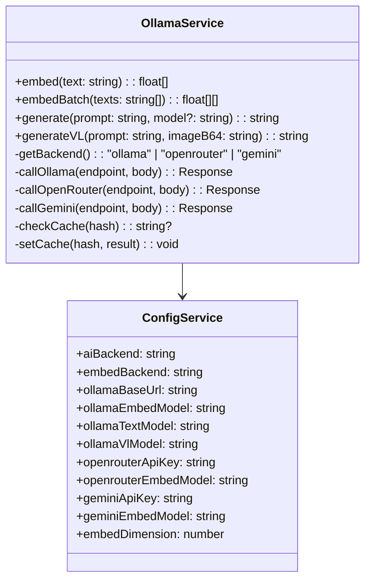

### 9.2 Embedding Flow

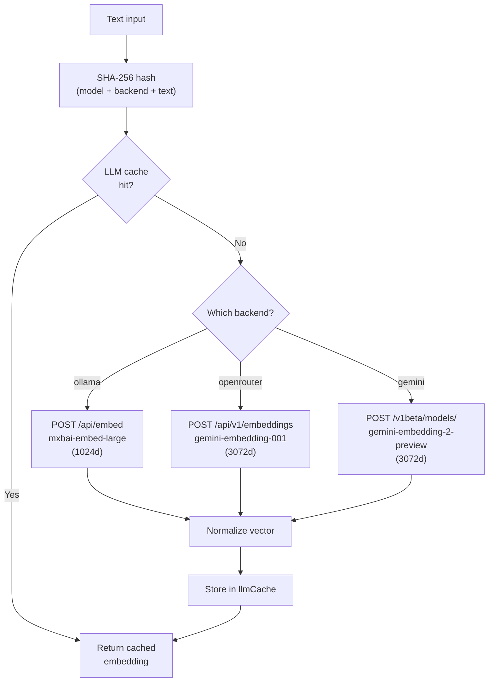

---

## 10. Job Queue Configuration

### 10.1 BullMQ Queue Settings

| Queue | Concurrency | Lock Duration | Max Attempts | Backoff |
|-------|-------------|---------------|--------------|---------|
| `sync` | 1 | 300s | 3 | Exponential (5s base) |
| `clean` | 5 | 300s | 3 | Exponential (5s base) |
| `embed` | 3 (configurable) | 300s | 3 | Exponential (5s base) |
| `enrich` | 3 (configurable) | 300s | 3 | Exponential (5s base) |

### 10.2 Job State Machine

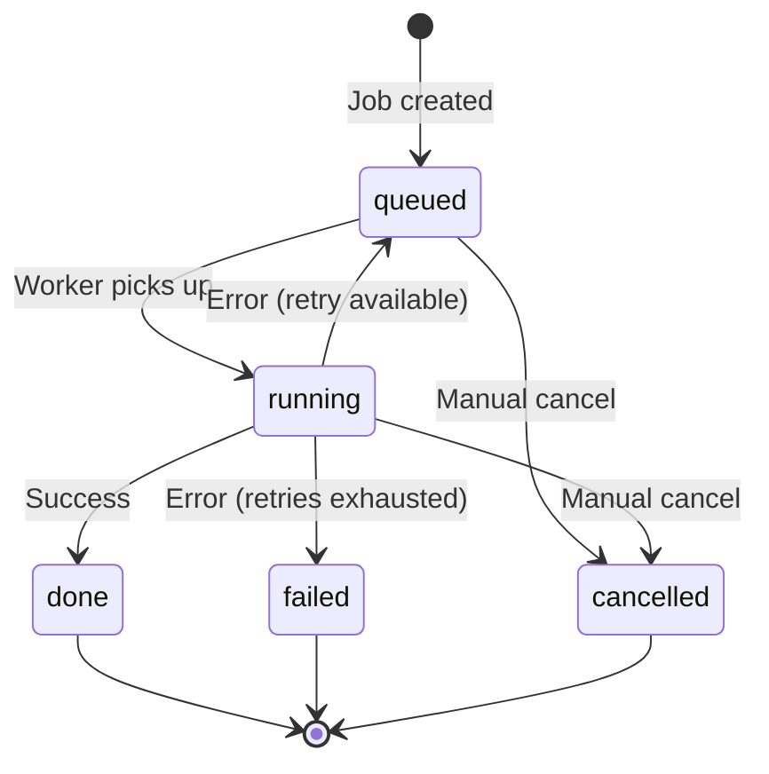

---

## 11. API Endpoints

### 11.1 REST API Routes

| Method | Path | Controller | Auth | Purpose |
|--------|------|------------|------|---------|
| `POST` | `/api/user-auth/signup` | UserAuthController | None | Register user |
| `POST` | `/api/user-auth/login` | UserAuthController | None | Login (JWT) |
| `POST` | `/api/user-auth/firebase-login` | UserAuthController | Firebase | Firebase SSO |
| `POST` | `/api/user-auth/recovery-key` | UserAuthController | Auth | Submit recovery key |
| `GET` | `/api/accounts` | AccountsController | Auth | List accounts |
| `POST` | `/api/accounts` | AccountsController | Auth | Create account |
| `DELETE` | `/api/accounts/:id` | AccountsController | Auth | Delete account |
| `GET` | `/api/connectors` | ConnectorsController | Auth | List available connectors |
| `GET` | `/api/connectors/:type/manifest` | ConnectorsController | Auth | Get connector manifest |
| `POST` | `/api/auth/:type/initiate` | AuthController | Auth | Start OAuth/QR flow |
| `GET` | `/api/auth/:type/callback` | AuthController | None | OAuth callback |
| `POST` | `/api/jobs/sync/:accountId` | JobsController | Auth | Trigger sync |
| `GET` | `/api/jobs` | JobsController | Auth | List jobs |
| `GET` | `/api/jobs/:id` | JobsController | Auth | Get job detail |
| `GET` | `/api/jobs/:id/logs` | JobsController | Auth | Get job logs |
| `GET` | `/api/memory/search` | MemoryController | Auth | Search memories |
| `GET` | `/api/memory/:id` | MemoryController | Auth | Get single memory |
| `GET` | `/api/memory/graph` | MemoryController | Auth | Get memory graph |
| `GET` | `/api/memory/timeline` | MemoryController | Auth | Timeline view |
| `GET` | `/api/people` | PeopleController | Auth | List contacts |
| `POST` | `/api/people/merge` | PeopleController | Auth | Merge contacts |
| `GET` | `/api/memory-banks` | MemoryBanksController | Auth | List memory banks |
| `POST` | `/api/memory-banks` | MemoryBanksController | Auth | Create bank |
| `GET` | `/api/settings` | SettingsController | Auth | Get settings |
| `PUT` | `/api/settings` | SettingsController | Auth | Update settings |
| `GET` | `/api/version` | AppController | None | Health check |
| `WS` | `/events` | EventsGateway | Auth | Real-time events |

---

## 12. Error Handling

### 12.1 Error Hierarchy

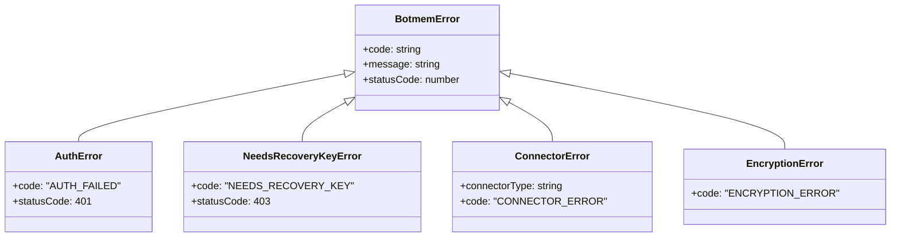

---

## 13. Deployment Architecture

### 13.1 Docker Compose Stack

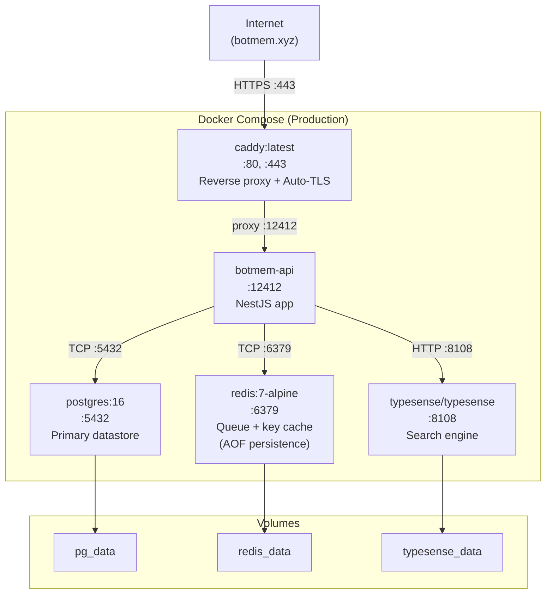

### 13.2 CI/CD Pipeline

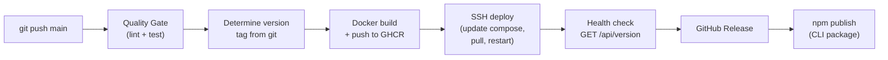
