# Botmem — Sequence Diagrams

All diagrams use Mermaid syntax and cover the core user workflows end-to-end.

---

## 1. User Signup & Recovery Key

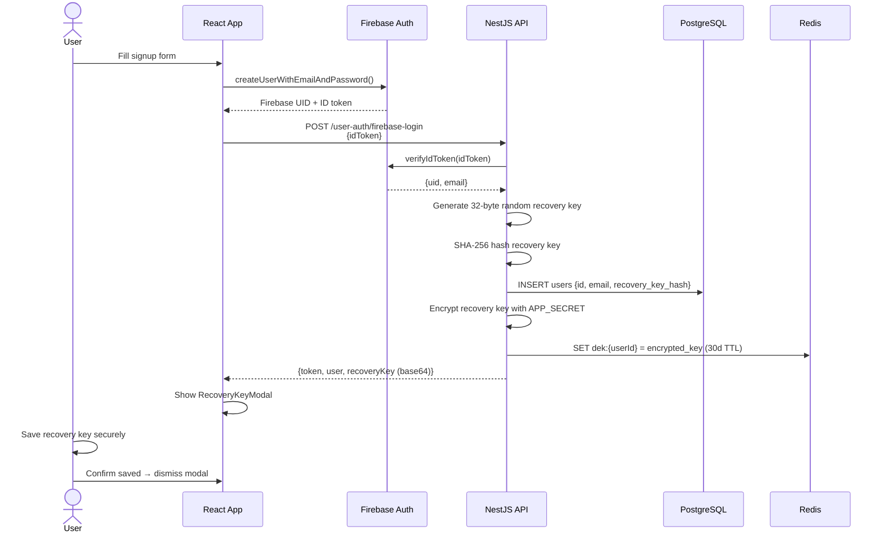
```mermaid
sequenceDiagram
    actor User
    participant Web as React App
    participant Firebase as Firebase Auth
    participant API as NestJS API
    participant DB as PostgreSQL
    participant Redis

    User->>Web: Fill signup form
    Web->>Firebase: createUserWithEmailAndPassword()
    Firebase-->>Web: Firebase UID + ID token

    Web->>API: POST /user-auth/firebase-login<br/>{idToken}
    API->>Firebase: verifyIdToken(idToken)
    Firebase-->>API: {uid, email}

    API->>API: Generate 32-byte random recovery key
    API->>API: SHA-256 hash recovery key
    API->>DB: INSERT users {id, email, recovery_key_hash}
    API->>API: Encrypt recovery key with APP_SECRET
    API->>Redis: SET dek:{userId} = encrypted_key (30d TTL)
    API-->>Web: {token, user, recoveryKey (base64)}

    Web->>Web: Show RecoveryKeyModal
    User->>User: Save recovery key securely
    User->>Web: Confirm saved → dismiss modal
```

---

## 2. User Login (Returning User — Key Cached)

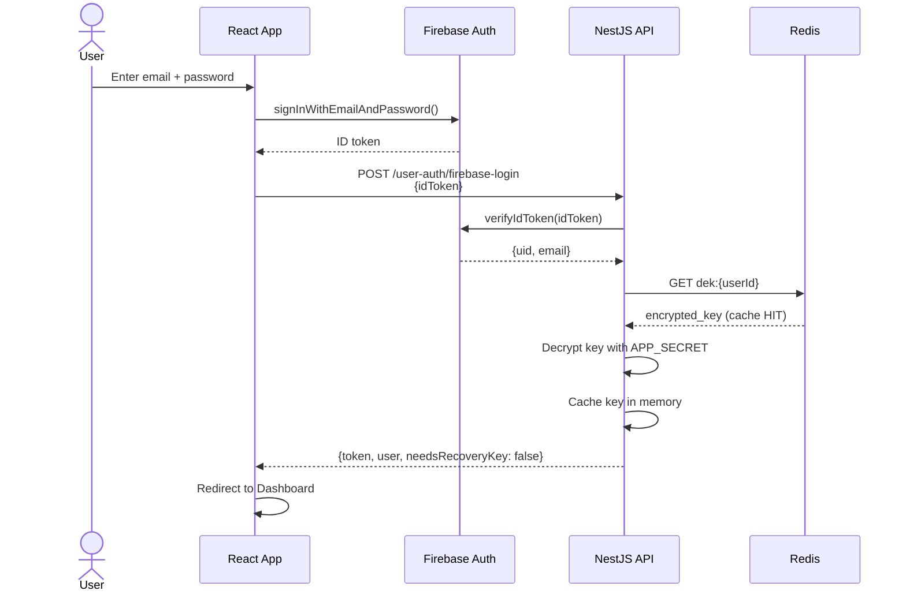
```mermaid
sequenceDiagram
    actor User
    participant Web as React App
    participant Firebase as Firebase Auth
    participant API as NestJS API
    participant Redis

    User->>Web: Enter email + password
    Web->>Firebase: signInWithEmailAndPassword()
    Firebase-->>Web: ID token

    Web->>API: POST /user-auth/firebase-login<br/>{idToken}
    API->>Firebase: verifyIdToken(idToken)
    Firebase-->>API: {uid, email}

    API->>Redis: GET dek:{userId}
    Redis-->>API: encrypted_key (cache HIT)
    API->>API: Decrypt key with APP_SECRET
    API->>API: Cache key in memory
    API-->>Web: {token, user, needsRecoveryKey: false}

    Web->>Web: Redirect to Dashboard
```

---

## 3. User Login (Cold Cache — Recovery Key Needed)

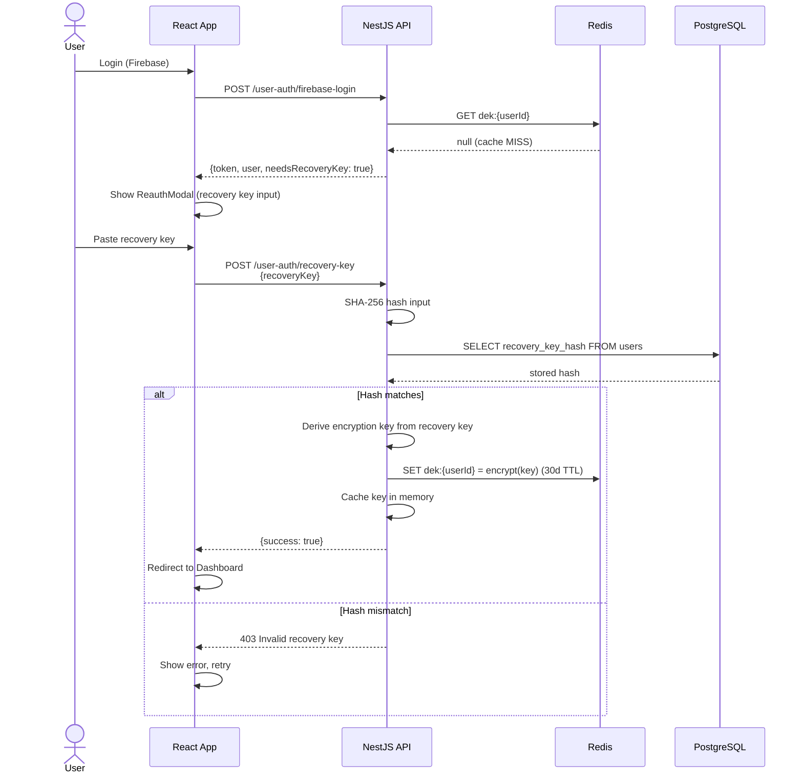
```mermaid
sequenceDiagram
    actor User
    participant Web as React App
    participant API as NestJS API
    participant Redis
    participant DB as PostgreSQL

    User->>Web: Login (Firebase)
    Web->>API: POST /user-auth/firebase-login
    API->>Redis: GET dek:{userId}
    Redis-->>API: null (cache MISS)
    API-->>Web: {token, user, needsRecoveryKey: true}

    Web->>Web: Show ReauthModal (recovery key input)
    User->>Web: Paste recovery key
    Web->>API: POST /user-auth/recovery-key<br/>{recoveryKey}

    API->>API: SHA-256 hash input
    API->>DB: SELECT recovery_key_hash FROM users
    DB-->>API: stored hash

    alt Hash matches
        API->>API: Derive encryption key from recovery key
        API->>Redis: SET dek:{userId} = encrypt(key) (30d TTL)
        API->>API: Cache key in memory
        API-->>Web: {success: true}
        Web->>Web: Redirect to Dashboard
    else Hash mismatch
        API-->>Web: 403 Invalid recovery key
        Web->>Web: Show error, retry
    end
```

---

## 4. Connector Setup (OAuth2 — Gmail)

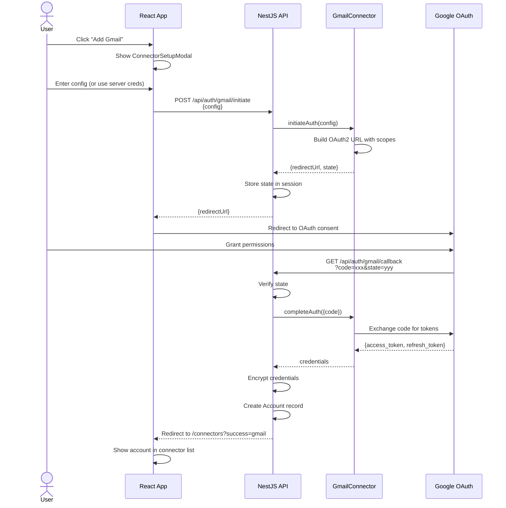
```mermaid
sequenceDiagram
    actor User
    participant Web as React App
    participant API as NestJS API
    participant Conn as GmailConnector
    participant Google as Google OAuth

    User->>Web: Click "Add Gmail"
    Web->>Web: Show ConnectorSetupModal
    User->>Web: Enter config (or use server creds)
    Web->>API: POST /api/auth/gmail/initiate<br/>{config}

    API->>Conn: initiateAuth(config)
    Conn->>Conn: Build OAuth2 URL with scopes
    Conn-->>API: {redirectUrl, state}
    API->>API: Store state in session
    API-->>Web: {redirectUrl}

    Web->>Google: Redirect to OAuth consent
    User->>Google: Grant permissions
    Google->>API: GET /api/auth/gmail/callback<br/>?code=xxx&state=yyy

    API->>API: Verify state
    API->>Conn: completeAuth({code})
    Conn->>Google: Exchange code for tokens
    Google-->>Conn: {access_token, refresh_token}
    Conn-->>API: credentials

    API->>API: Encrypt credentials
    API->>API: Create Account record
    API-->>Web: Redirect to /connectors?success=gmail
    Web->>Web: Show account in connector list
```

---

## 5. Connector Setup (QR Code — WhatsApp)

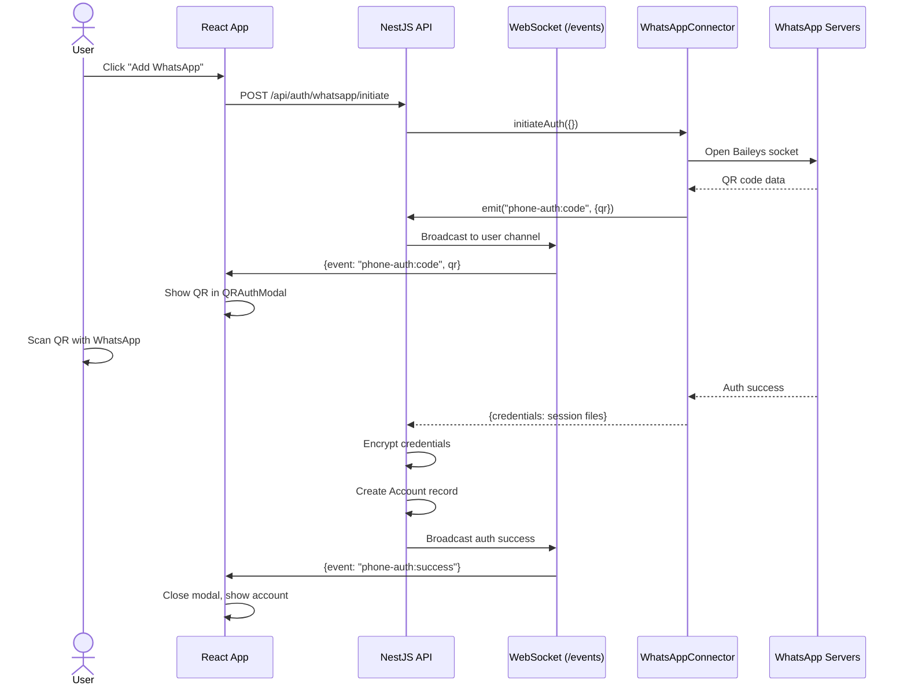
```mermaid
sequenceDiagram
    actor User
    participant Web as React App
    participant API as NestJS API
    participant WS as WebSocket (/events)
    participant Conn as WhatsAppConnector
    participant WA as WhatsApp Servers

    User->>Web: Click "Add WhatsApp"
    Web->>API: POST /api/auth/whatsapp/initiate
    API->>Conn: initiateAuth({})
    Conn->>WA: Open Baileys socket
    WA-->>Conn: QR code data

    Conn->>API: emit("phone-auth:code", {qr})
    API->>WS: Broadcast to user channel
    WS->>Web: {event: "phone-auth:code", qr}
    Web->>Web: Show QR in QRAuthModal

    User->>User: Scan QR with WhatsApp
    WA-->>Conn: Auth success
    Conn-->>API: {credentials: session files}

    API->>API: Encrypt credentials
    API->>API: Create Account record
    API->>WS: Broadcast auth success
    WS->>Web: {event: "phone-auth:success"}
    Web->>Web: Close modal, show account
```

---

## 6. Data Sync (Full Pipeline)

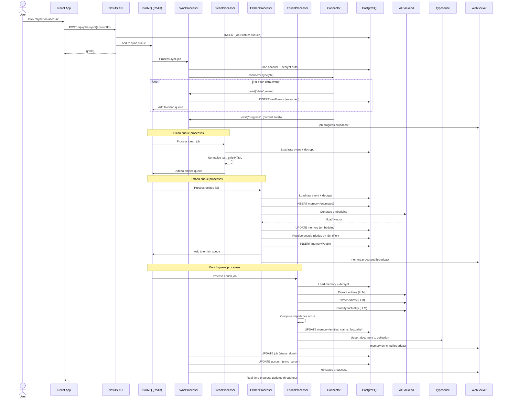
```mermaid
sequenceDiagram
    actor User
    participant Web as React App
    participant API as NestJS API
    participant BullMQ as BullMQ (Redis)
    participant Sync as SyncProcessor
    participant Clean as CleanProcessor
    participant Embed as EmbedProcessor
    participant Enrich as EnrichProcessor
    participant Conn as Connector
    participant DB as PostgreSQL
    participant AI as AI Backend
    participant TS as Typesense
    participant WS as WebSocket

    User->>Web: Click "Sync" on account
    Web->>API: POST /api/jobs/sync/{accountId}
    API->>DB: INSERT job (status: queued)
    API->>BullMQ: Add to sync queue
    API-->>Web: {jobId}

    BullMQ->>Sync: Process sync job
    Sync->>DB: Load account + decrypt auth
    Sync->>Conn: connector.sync(ctx)

    loop For each data event
        Conn->>Sync: emit("data", event)
        Sync->>DB: INSERT rawEvents (encrypted)
        Sync->>BullMQ: Add to clean queue
    end

    Conn->>Sync: emit("progress", {current, total})
    Sync->>WS: job:progress broadcast

    Note over BullMQ,Clean: Clean queue processes

    BullMQ->>Clean: Process clean job
    Clean->>DB: Load raw event + decrypt
    Clean->>Clean: Normalize text, strip HTML
    Clean->>BullMQ: Add to embed queue

    Note over BullMQ,Embed: Embed queue processes

    BullMQ->>Embed: Process embed job
    Embed->>DB: Load raw event + decrypt
    Embed->>DB: INSERT memory (encrypted)
    Embed->>AI: Generate embedding
    AI-->>Embed: float[] vector
    Embed->>DB: UPDATE memory (embedding)
    Embed->>DB: Resolve people (dedup by identifier)
    Embed->>DB: INSERT memoryPeople
    Embed->>BullMQ: Add to enrich queue
    Embed->>WS: memory:processed broadcast

    Note over BullMQ,Enrich: Enrich queue processes

    BullMQ->>Enrich: Process enrich job
    Enrich->>DB: Load memory + decrypt
    Enrich->>AI: Extract entities (LLM)
    Enrich->>AI: Extract claims (LLM)
    Enrich->>AI: Classify factuality (LLM)
    Enrich->>Enrich: Compute importance score
    Enrich->>DB: UPDATE memory (entities, claims, factuality)
    Enrich->>TS: Upsert document to collection
    Enrich->>WS: memory:enriched broadcast

    Sync->>DB: UPDATE job (status: done)
    Sync->>DB: UPDATE account (sync_cursor)
    Sync->>WS: job:status broadcast
    WS->>Web: Real-time progress updates throughout
```

---

## 7. Memory Search (Hybrid RAG)

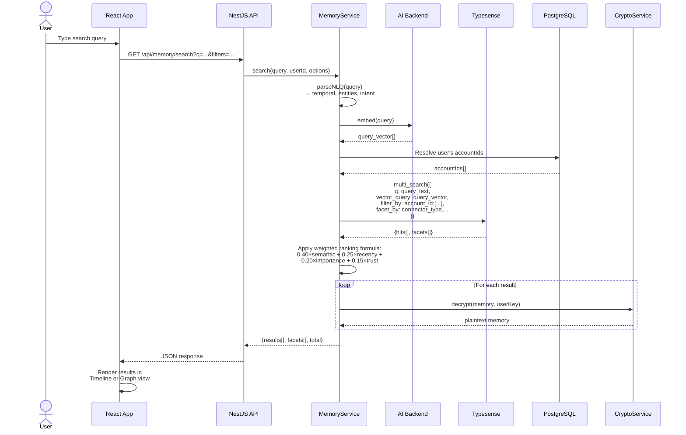
```mermaid
sequenceDiagram
    actor User
    participant Web as React App
    participant API as NestJS API
    participant Mem as MemoryService
    participant AI as AI Backend
    participant TS as Typesense
    participant DB as PostgreSQL
    participant Crypto as CryptoService

    User->>Web: Type search query
    Web->>API: GET /api/memory/search?q=...&filters=...

    API->>Mem: search(query, userId, options)

    Mem->>Mem: parseNLQ(query)<br/>→ temporal, entities, intent
    Mem->>AI: embed(query)
    AI-->>Mem: query_vector[]

    Mem->>DB: Resolve user's accountIds
    DB-->>Mem: accountIds[]

    Mem->>TS: multi_search({<br/>  q: query_text,<br/>  vector_query: query_vector,<br/>  filter_by: account_id:[...],<br/>  facet_by: connector_type,...<br/>})
    TS-->>Mem: {hits[], facets[]}

    Mem->>Mem: Apply weighted ranking formula:<br/>0.40×semantic + 0.25×recency +<br/>0.20×importance + 0.15×trust

    loop For each result
        Mem->>Crypto: decrypt(memory, userKey)
        Crypto-->>Mem: plaintext memory
    end

    Mem-->>API: {results[], facets[], total}
    API-->>Web: JSON response

    Web->>Web: Render results in<br/>Timeline or Graph view
```

---

## 8. Graph Visualization Loading

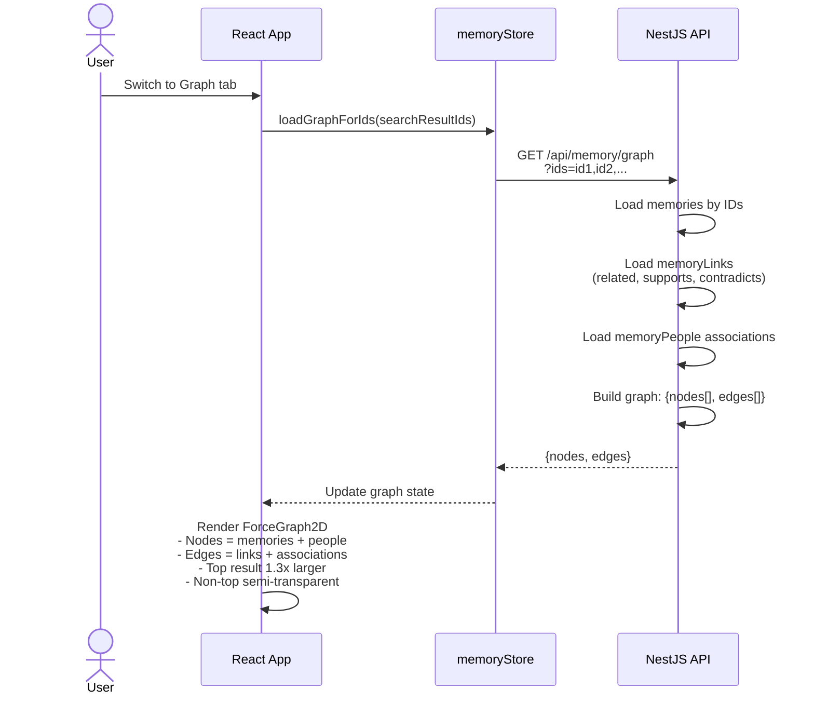
```mermaid
sequenceDiagram
    actor User
    participant Web as React App
    participant Store as memoryStore
    participant API as NestJS API

    User->>Web: Switch to Graph tab
    Web->>Store: loadGraphForIds(searchResultIds)
    Store->>API: GET /api/memory/graph<br/>?ids=id1,id2,...

    API->>API: Load memories by IDs
    API->>API: Load memoryLinks<br/>(related, supports, contradicts)
    API->>API: Load memoryPeople associations
    API->>API: Build graph: {nodes[], edges[]}

    API-->>Store: {nodes, edges}
    Store-->>Web: Update graph state

    Web->>Web: Render ForceGraph2D<br/>- Nodes = memories + people<br/>- Edges = links + associations<br/>- Top result 1.3x larger<br/>- Non-top semi-transparent
```

---

## 9. Contact Resolution (During Embed)

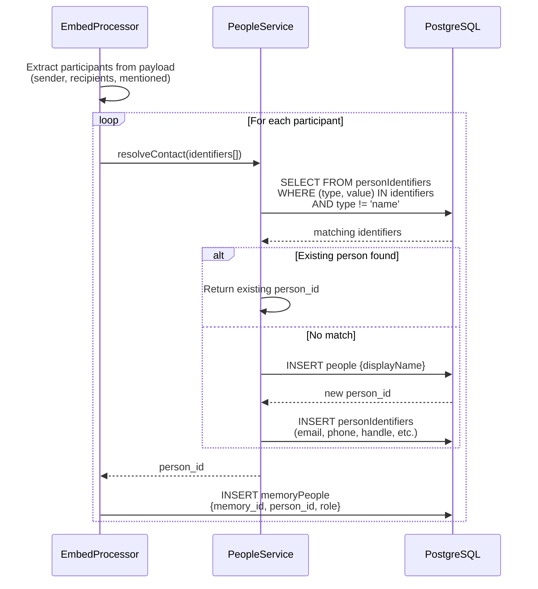
```mermaid
sequenceDiagram
    participant Embed as EmbedProcessor
    participant People as PeopleService
    participant DB as PostgreSQL

    Embed->>Embed: Extract participants from payload<br/>(sender, recipients, mentioned)

    loop For each participant
        Embed->>People: resolveContact(identifiers[])

        People->>DB: SELECT FROM personIdentifiers<br/>WHERE (type, value) IN identifiers<br/>AND type != 'name'
        DB-->>People: matching identifiers

        alt Existing person found
            People->>People: Return existing person_id
        else No match
            People->>DB: INSERT people {displayName}
            DB-->>People: new person_id
            People->>DB: INSERT personIdentifiers<br/>(email, phone, handle, etc.)
        end

        People-->>Embed: person_id

        Embed->>DB: INSERT memoryPeople<br/>{memory_id, person_id, role}
    end
```

---

## 10. Real-Time Job Monitoring (WebSocket)

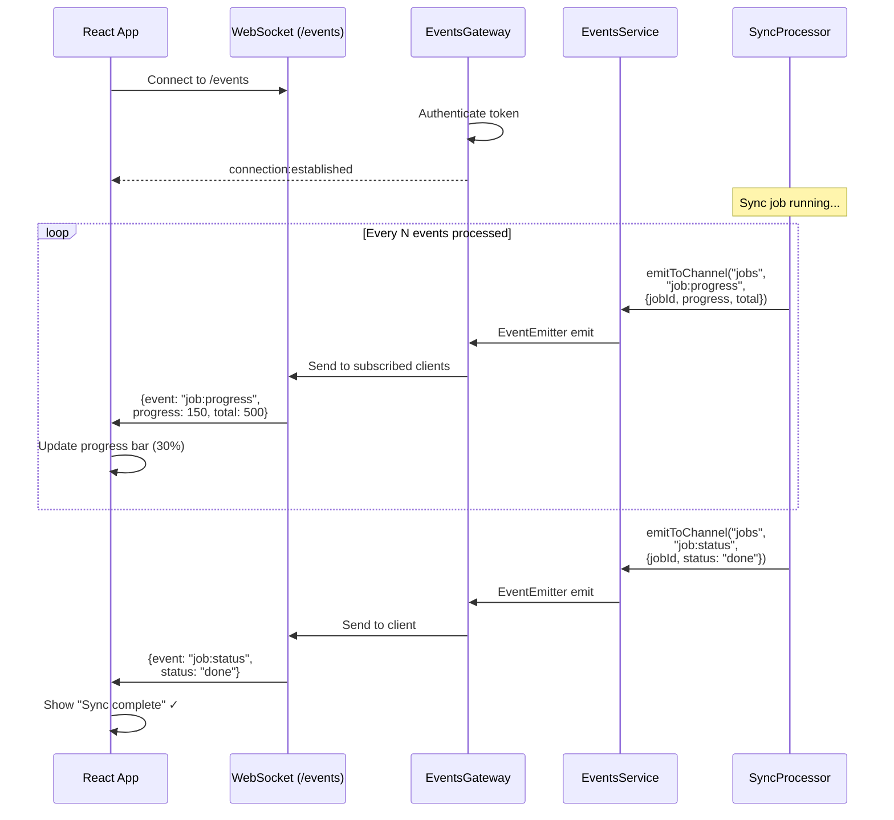
```mermaid
sequenceDiagram
    participant Web as React App
    participant WS as WebSocket (/events)
    participant GW as EventsGateway
    participant ES as EventsService
    participant Proc as SyncProcessor

    Web->>WS: Connect to /events
    GW->>GW: Authenticate token
    GW-->>Web: connection:established

    Note over Proc: Sync job running...

    loop Every N events processed
        Proc->>ES: emitToChannel("jobs",<br/>"job:progress",<br/>{jobId, progress, total})
        ES->>GW: EventEmitter emit
        GW->>WS: Send to subscribed clients
        WS->>Web: {event: "job:progress",<br/>progress: 150, total: 500}
        Web->>Web: Update progress bar (30%)
    end

    Proc->>ES: emitToChannel("jobs",<br/>"job:status",<br/>{jobId, status: "done"})
    ES->>GW: EventEmitter emit
    GW->>WS: Send to client
    WS->>Web: {event: "job:status",<br/>status: "done"}
    Web->>Web: Show "Sync complete" ✓
```

---

## 11. API Key Authentication (CLI / Agents)

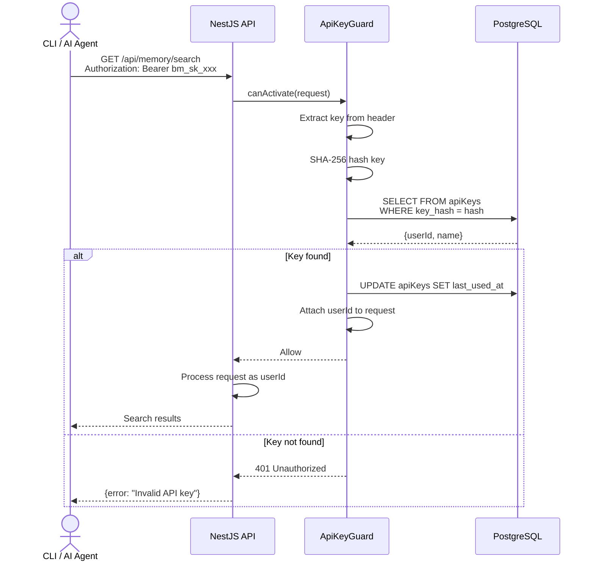
```mermaid
sequenceDiagram
    actor Agent as CLI / AI Agent
    participant API as NestJS API
    participant Guard as ApiKeyGuard
    participant DB as PostgreSQL

    Agent->>API: GET /api/memory/search<br/>Authorization: Bearer bm_sk_xxx

    API->>Guard: canActivate(request)
    Guard->>Guard: Extract key from header
    Guard->>Guard: SHA-256 hash key
    Guard->>DB: SELECT FROM apiKeys<br/>WHERE key_hash = hash
    DB-->>Guard: {userId, name}

    alt Key found
        Guard->>DB: UPDATE apiKeys SET last_used_at
        Guard->>Guard: Attach userId to request
        Guard-->>API: Allow
        API->>API: Process request as userId
        API-->>Agent: Search results
    else Key not found
        Guard-->>API: 401 Unauthorized
        API-->>Agent: {error: "Invalid API key"}
    end
```

---

## 12. Memory Decay (Background)

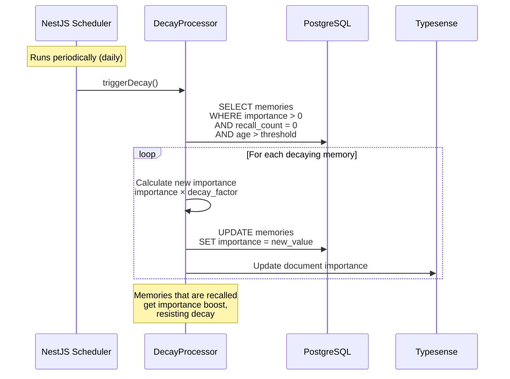
```mermaid
sequenceDiagram
    participant Cron as NestJS Scheduler
    participant Decay as DecayProcessor
    participant DB as PostgreSQL
    participant TS as Typesense

    Note over Cron: Runs periodically (daily)

    Cron->>Decay: triggerDecay()
    Decay->>DB: SELECT memories<br/>WHERE importance > 0<br/>AND recall_count = 0<br/>AND age > threshold

    loop For each decaying memory
        Decay->>Decay: Calculate new importance<br/>importance × decay_factor
        Decay->>DB: UPDATE memories<br/>SET importance = new_value
        Decay->>TS: Update document importance
    end

    Note over Decay: Memories that are recalled<br/>get importance boost,<br/>resisting decay
```

---

## 13. OAuth2 Provider Flow (External Apps)

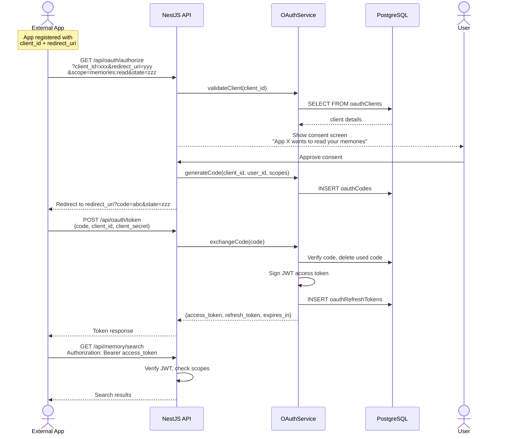
```mermaid
sequenceDiagram
    actor ExtApp as External App
    participant API as NestJS API
    participant OAuth as OAuthService
    participant DB as PostgreSQL
    actor User

    Note over ExtApp: App registered with<br/>client_id + redirect_uri

    ExtApp->>API: GET /api/oauth/authorize<br/>?client_id=xxx&redirect_uri=yyy<br/>&scope=memories:read&state=zzz

    API->>OAuth: validateClient(client_id)
    OAuth->>DB: SELECT FROM oauthClients
    DB-->>OAuth: client details

    API-->>User: Show consent screen<br/>"App X wants to read your memories"

    User->>API: Approve consent
    API->>OAuth: generateCode(client_id, user_id, scopes)
    OAuth->>DB: INSERT oauthCodes
    API-->>ExtApp: Redirect to redirect_uri?code=abc&state=zzz

    ExtApp->>API: POST /api/oauth/token<br/>{code, client_id, client_secret}
    API->>OAuth: exchangeCode(code)
    OAuth->>DB: Verify code, delete used code
    OAuth->>OAuth: Sign JWT access token
    OAuth->>DB: INSERT oauthRefreshTokens
    OAuth-->>API: {access_token, refresh_token, expires_in}
    API-->>ExtApp: Token response

    ExtApp->>API: GET /api/memory/search<br/>Authorization: Bearer access_token
    API->>API: Verify JWT, check scopes
    API-->>ExtApp: Search results
```

---

## 14. Encryption Key Lifecycle

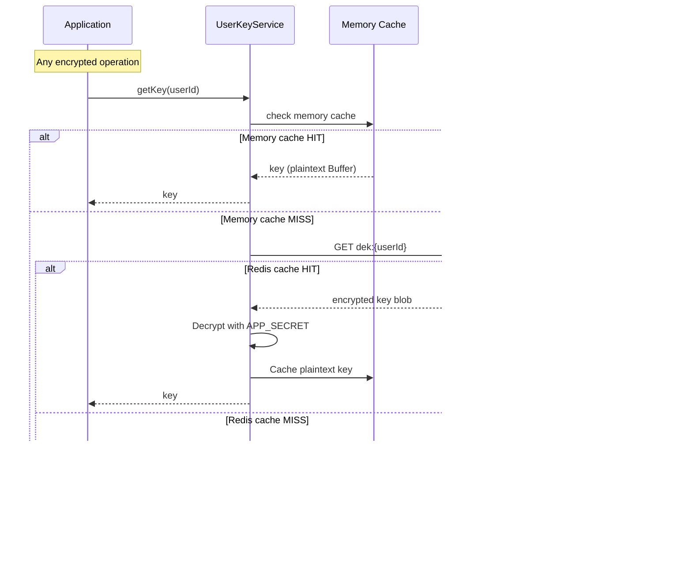
```mermaid
sequenceDiagram
    participant App as Application
    participant UKS as UserKeyService
    participant Mem as Memory Cache
    participant Redis as Redis Cache
    participant DB as PostgreSQL

    Note over App: Any encrypted operation

    App->>UKS: getKey(userId)

    UKS->>Mem: check memory cache
    alt Memory cache HIT
        Mem-->>UKS: key (plaintext Buffer)
        UKS-->>App: key
    else Memory cache MISS
        UKS->>Redis: GET dek:{userId}
        alt Redis cache HIT
            Redis-->>UKS: encrypted key blob
            UKS->>UKS: Decrypt with APP_SECRET
            UKS->>Mem: Cache plaintext key
            UKS-->>App: key
        else Redis cache MISS
            UKS-->>App: throw NeedsRecoveryKeyError
            Note over App: Client must submit<br/>recovery key via API
        end
    end
```
